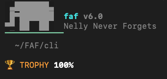

<div style="display: flex; align-items: center; gap: 12px;">
  
  <div>
    <h1 style="margin: 0; color: #000000;">faf-cli</h1>
    <p style="margin: 4px 0 0 0;"><strong>The package.json for AI Context</strong></p>
  </div>
</div>

[](https://github.com/Wolfe-Jam/faf-taf-git)
[](https://github.com/Wolfe-Jam/faf-cli/actions/workflows/ci.yml)
[](https://www.npmjs.com/package/faf-cli)
[](https://www.npmjs.com/package/faf-cli)
[](https://github.com/Wolfe-Jam/homebrew-faf)
[](https://faf.one)
[](https://opensource.org/licenses/MIT)
[](https://bun.sh)
[](https://github.com/Wolfe-Jam/faf)

> **51,582+ downloads** | **Claude Code Skills** | **Homebrew AI Tools** | **Championship-grade developer productivity**

```
project/
├── package.json     ← npm reads this
├── project.faf      ← AI reads this
└── src/
```

> **Every building requires a foundation. `project.faf` is AI's foundation.**
>
> You have a `package.json`. Add a `project.faf`. Done.

**Git-Native.** `project.faf` versions with your code — every clone, every fork, every checkout gets full AI context. No setup, no drift, no re-explaining.

10 lines of structured YAML gives AI more context than 550 lines of prose. [Read why →](https://faf.one/blog/sunset-edition)

---

## Install

```bash
bunx faf                           # That's it. FAF is all you need.
npx faf                            # Also works.
brew install faf-cli && faf        # Homebrew
```

Three letters. Auto-detects your project, creates `.faf`, scores it, tells you what's next.

**Before:** `bunx faf-cli auto` — 18 characters, you had to know the command.
**Now:** `bunx faf` — 8 characters, does everything automatically.

---

## Nelly Never Forgets

Run `faf` with no arguments:



---

## v6.0 — Built with Bun

v6 is a ground-up rewrite. All-in on Bun — same toolchain as Claude Code.

| | Claude Code | faf-cli v6 |
|-|-------------|------------|
| **Runtime** | Bun | Bun (`bunx`) |
| **Test** | Bun | `bun test` |
| **Build** | Bun | `bun build` |
| **Language** | TypeScript | TypeScript |
| **Compile** | Bun bytecode | `bun build --compile` |

375 tests in ~19s. 95KB package in 1s. Single portable binary, 4 platforms. npx backward-compatible.

26 commands. 375 tests. 3,182 lines. 94% smaller than v5.

```
commands → interop → core → wasm
```

The WASM scoring kernel (`faf-scoring-kernel`) does the math. Bun does the delivery.

---

## Commands

| # | Command | One-liner |
|---|---------|-----------|
| 1 | `faf init` | Create `.faf` from your local project |
| 2 | `faf git <url>` | Instant `.faf` from any GitHub repo — no clone |
| 3 | `faf auto` | Zero to 100% in one command |
| 4 | `faf go` | Guided interview to gold code |
| 5 | `faf score` | Check AI-readiness (0-100%) |
| 6 | `faf sync` | `.faf` ↔ CLAUDE.md (bi-sync, mtime auto-direction) |
| 7 | `faf compile` | `.faf` → `.fafb` binary — sealed, portable, deterministic |
| 8 | `faf decompile` | `.fafb` → JSON |
| 9 | `faf export` | Generate AGENTS.md, .cursorrules, GEMINI.md |
| 10 | `faf check` | Validate `.faf` file |
| 11 | `faf edit` | Edit `.faf` fields inline |
| 12 | `faf convert` | Convert `.faf` to JSON |
| 13 | `faf drift` | Check context drift |
| 14 | `faf context` | Generate context output |
| 15 | `faf recover` | Recover `.faf` from CLAUDE.md / AGENTS.md |
| 16 | `faf migrate` | Migrate `.faf` to latest version |
| 17 | `faf search` | Search slots and formats |
| 18 | `faf share` | Share `.faf` via URL |
| 19 | `faf taf` | Generate TAF test receipt |
| 20 | `faf demo` | Demo walkthrough |
| 21 | `faf ai` | AI-powered enhance & analyze |
| 22 | `faf pro` | Pro features & licensing |
| 23 | `faf conductor` | Conductor integration |
| 24 | `faf formats` | Show supported formats |
| 25 | `faf info` | Version and system info |
| 26 | `faf clear` | Clear cached data |

Run `faf --help` for full options.

---

## Quick Start

```bash
# ANY GitHub repo — no clone, no install, 2 seconds
bunx faf-cli git https://github.com/facebook/react

# Your own project
bunx faf-cli init              # Create .faf
bunx faf-cli auto              # Zero to 100% in one command
bunx faf-cli go                # Interactive interview to gold code
```

---

## Scoring

| Tier | Score | Status |
|------|-------|--------|
| 🏆 Trophy | 100% | AI Optimized — Gold Code |
| ★ Gold | 99%+ | Near-perfect |
| ◆ Silver | 95%+ | Excellent |
| ◇ Bronze | 85%+ | Production ready |
| ● Green | 70%+ | Solid foundation |
| ● Yellow | 55%+ | AI flipping coins |
| ○ Red | <55% | AI working blind |
| ♡ White | 0% | No context |

---

## Project Types

faf-cli auto-detects your project type and activates the right slots:

| Type | Detection | Active Slots |
|------|-----------|-------------|
| **mcp** | `@modelcontextprotocol/sdk`, `fastmcp`, `mcp`, `rmcp` | project + backend + universal + human |
| **fullstack** | Next.js, Nuxt, frontend + backend | project + frontend + backend + universal + human |
| **svelte** | SvelteKit / Svelte | project + frontend + backend + universal + human |
| **backend** | FastAPI, Express, Django, Flask | project + backend + universal + human |
| **frontend** | React, Vue, Angular (no backend) | project + frontend + human |
| **cli** | `bin` field in package.json | project + human |
| **library** | No framework signals | project + human |

### MCP Server Detection

10 MCP frameworks supported. Your MCP server gets the right type, backend, and framework sub-type automatically:

```yaml
project:
  type: mcp
  framework: fastmcp       # or: mcp-sdk-ts, mcp-sdk-py, rmcp
stack:
  backend: FastMCP          # auto-filled from MCP SDK
  api_type: MCP (stdio/SSE) # auto-filled
```

### Python & Rust Support

Project name and description read from `pyproject.toml` and `Cargo.toml` — not just `package.json`. Python deps (FastAPI, SQLAlchemy, Django) and Rust deps (rmcp, tokio) detected from manifests.

---

## Sync

```
bi-sync:   .faf  ←── 8ms ──→  CLAUDE.md                (free forever)
tri-sync:  .faf  ←── 8ms ──→  CLAUDE.md ↔ MEMORY.md    (free for devs 🐘)
```

Nelly never forgets — and now she's free for all builders 🐘 Teams & Enterprise: [faf.one/pro](https://faf.one/pro) (plans)

---

## Compiled Binaries

Bun's single-file compiler produces standalone binaries — no runtime needed.

```bash
bun run compile                # Current platform
bun run compile:all            # darwin-arm64, darwin-x64, linux-x64, windows-x64
```

Ship `faf` as a single binary for CI/CD, Docker, or air-gapped environments.

---

## Architecture

```
src/
├── cli.ts              ← Entry point, 26 command registrations
├── commands/           ← 26 command files (1 per command)
├── core/               ← Types, slots (33 Mk4), tiers, scorer, schema
├── detect/             ← Framework detection, stack scanner
├── interop/            ← YAML I/O, CLAUDE.md, AGENTS.md, GEMINI.md
├── ui/                 ← Colors (#00D4D4), display
└── wasm/               ← faf-scoring-kernel wrapper (Rust → WASM)
```

**Toolchain:** Bun (test, build, compile) · TypeScript (strict) · WASM (scoring kernel)

---

## Testing

```bash
bun test                       # 375 tests, 41 files, ~19s
```

Full e2e lifecycle test runs every command in sequence: init → auto → score → edit → sync → export → compile → decompile → taf → recover → check. Test reports in `reports/`.

---

## Support

- **[GitHub Discussions](https://github.com/Wolfe-Jam/faf-cli/discussions)** — Questions, ideas, community
- **Email:** team@faf.one

---

If `faf-cli` has been useful, consider starring the repo — it helps others find it.

---

## License

MIT — Free and open source

**IANA-registered:** [`application/vnd.faf+yaml`](https://www.iana.org/assignments/media-types/application/vnd.faf+yaml)

*format | driven 🏎️⚡️ [wolfejam.dev](https://wolfejam.dev)*
