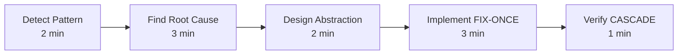

# 🛠️ FIX-ONCE Implementation Guide
**Practical Steps for Engineering Teams**

---

## 🚀 Quick Start (For Developers)

### When You See Multiple Similar Errors

```bash
# 1. STOP! Don't fix individually
# 2. Run CASCADE detection
npm test 2>&1 | grep "Error" | head -20

# 3. If you see patterns, implement FIX-ONCE
mkdir -p src/fix-once
touch src/fix-once/solution.ts
```

### 10-Minute FIX-ONCE Process



---

## 📝 Team Playbook

### For Team Leads

#### Setting Up FIX-ONCE Culture

1. **Establish Protection Rules**
```yaml
# .github/CODEOWNERS
/src/fix-once/ @team-lead @senior-dev

# Require approval for FIX-ONCE changes
```

2. **Create Review Process**
```markdown
## FIX-ONCE PR Template

### Root Cause Analysis
- What is the root cause?
- How many errors will this fix?

### CASCADE Impact
- Immediate fixes: X errors
- Future prevention: Y scenarios

### Testing
- [ ] All tests pass
- [ ] CASCADE verified
- [ ] Documentation updated
```

3. **Track Metrics**
```typescript
// Track FIX-ONCE effectiveness
interface FixOnceMetrics {
  module: string;
  created: Date;
  errorsBefore: number;
  errorsAfter: number;
  cascadeMultiplier: number;
  developerTime: number;
  maintainer: string;
}
```

### For Individual Contributors

#### How to Propose a FIX-ONCE

```markdown
## Issue Template: FIX-ONCE Proposal

**Title**: FIX-ONCE: [Brief Description]

**Problem Statement**
I've identified X similar errors across Y files.

**Root Cause**
The root cause is [explanation].

**Proposed Solution**
Create abstraction layer at src/fix-once/[module].ts

**Expected CASCADE**
- Fixes: X current errors
- Prevents: Y future errors
- Time saved: Z hours

**Implementation Plan**
1. Create abstraction
2. Update affected modules
3. Verify CASCADE effect
```

---

## 🏗️ Architecture Guidelines

### FIX-ONCE Directory Structure

```
src/
├── fix-once/                 # Protected CASCADE solutions
│   ├── README.md            # Directory documentation
│   ├── index.ts             # Public API exports
│   ├── colors.ts            # Color system
│   ├── types.ts             # Type registry
│   ├── output.ts            # Output formatting
│   ├── config.ts            # Configuration
│   ├── errors.ts            # Error handling
│   ├── validators.ts        # Validation rules
│   └── tests/               # FIX-ONCE specific tests
│       ├── colors.test.ts
│       └── types.test.ts
├── [rest of application]    # Uses fix-once modules
```

### Dependency Rules

```typescript
// ✅ GOOD: App depends on fix-once
import { colors } from '@/fix-once/colors';

// ❌ BAD: fix-once depends on app
// fix-once modules should NEVER import from app
```

### Layering Principle

```
Layer 3: Application Code
         ↓ (can import)
Layer 2: FIX-ONCE Modules
         ↓ (can import)
Layer 1: Node Modules

Never go up! ↑
```

---

## 🔨 Common FIX-ONCE Patterns

### Pattern 1: External Library Wrapper

**Problem**: Library API changes break multiple files

```typescript
// src/fix-once/library-wrapper.ts
import * as library from 'external-library';

// Stable API that never changes
export class LibraryWrapper {
  private static instance: LibraryWrapper;

  static getInstance(): LibraryWrapper {
    if (!this.instance) {
      this.instance = new LibraryWrapper();
    }
    return this.instance;
  }

  // Wrap unstable methods
  public stableMethod(...args: any[]): any {
    // Handle version differences here
    if (library.version >= '5.0.0') {
      return library.newMethod(...args);
    } else {
      return library.oldMethod(...args);
    }
  }
}

export const lib = LibraryWrapper.getInstance();
```

### Pattern 2: Central Type Registry

**Problem**: Type definitions scattered and conflicting

```typescript
// src/fix-once/types/index.ts
export * from './models';
export * from './api';
export * from './components';

// Compatibility layer for refactoring
export type LegacyUserType = User; // Gradual migration
```

### Pattern 3: Configuration Management

**Problem**: Hardcoded values throughout codebase

```typescript
// src/fix-once/config.ts
interface Config {
  api: {
    baseUrl: string;
    timeout: number;
    retries: number;
  };
  features: {
    [key: string]: boolean;
  };
}

class ConfigManager {
  private config: Config;

  constructor() {
    this.config = this.loadConfig();
  }

  private loadConfig(): Config {
    return {
      api: {
        baseUrl: process.env.API_URL || 'http://localhost:3000',
        timeout: parseInt(process.env.TIMEOUT || '5000'),
        retries: parseInt(process.env.RETRIES || '3'),
      },
      features: {
        darkMode: process.env.FEATURE_DARK_MODE === 'true',
        // ... other features
      }
    };
  }

  get<T extends keyof Config>(key: T): Config[T] {
    return this.config[key];
  }
}

export const config = new ConfigManager();
```

### Pattern 4: Error Handler

**Problem**: Inconsistent error handling

```typescript
// src/fix-once/errors.ts
export class AppError extends Error {
  constructor(
    message: string,
    public code: string,
    public statusCode: number = 500,
    public isOperational: boolean = true
  ) {
    super(message);
    Object.setPrototypeOf(this, AppError.prototype);
    Error.captureStackTrace(this, this.constructor);
  }
}

export const errorHandler = {
  handle(error: Error): AppError {
    if (error instanceof AppError) {
      return error;
    }

    // Convert unknown errors to AppError
    return new AppError(
      error.message || 'Unknown error',
      'UNKNOWN_ERROR',
      500,
      false
    );
  },

  isOperational(error: Error): boolean {
    if (error instanceof AppError) {
      return error.isOperational;
    }
    return false;
  }
};
```

---

## 🧪 Testing FIX-ONCE Modules

### Test Structure

```typescript
// src/fix-once/tests/colors.test.ts
import { colors, getScoreColor } from '../colors';

describe('FIX-ONCE: Colors Module', () => {
  describe('CASCADE Prevention Tests', () => {
    it('should work without chalk', () => {
      // Test that abstraction works even if chalk changes
      const result = colors.primary('test');
      expect(result).toBeDefined();
    });

    it('should handle NO_COLOR environment', () => {
      process.env.NO_COLOR = '1';
      const result = colors.primary('test');
      expect(result).toBe('test'); // No color codes
    });
  });

  describe('Score Color Logic', () => {
    it.each([
      [90, 'success'],
      [75, 'warning'],
      [40, 'error'],
    ])('score %i should use %s color', (score, expectedColor) => {
      const colorFn = getScoreColor(score);
      expect(colorFn.name).toBe(expectedColor);
    });
  });
});
```

### CASCADE Verification Test

```typescript
// src/fix-once/tests/cascade-verification.test.ts
describe('CASCADE Effect Verification', () => {
  it('should prevent type errors across all modules', () => {
    // Import all modules that use types
    const modules = [
      () => import('../../module1'),
      () => import('../../module2'),
      () => import('../../module3'),
    ];

    // All should compile without errors
    return Promise.all(modules.map(m =>
      expect(m()).resolves.toBeDefined()
    ));
  });

  it('should maintain CASCADE multiplier > 10x', () => {
    const errorsBefore = 50; // Historical data
    const errorsAfter = 0;   // Current state
    const fixCount = 2;      // Number of FIX-ONCE modules

    const multiplier = (errorsBefore - errorsAfter) / fixCount;
    expect(multiplier).toBeGreaterThan(10);
  });
});
```

---

## 📊 Monitoring & Metrics

### FIX-ONCE Dashboard

```typescript
// src/fix-once/metrics.ts
export interface FixOnceDashboard {
  getTotalImpact(): {
    modulesCreated: number;
    errorsEliminated: number;
    futureErrorsPrevented: number;
    averageMultiplier: number;
    timesSaved: number; // hours
  };

  getModuleHealth(module: string): {
    age: number; // days
    modifications: number;
    errorsPrevented: number;
    lastModified: Date;
    maintainer: string;
    healthScore: number; // 0-100
  };

  getRecommendations(): {
    module: string;
    reason: string;
    priority: 'HIGH' | 'MEDIUM' | 'LOW';
  }[];
}
```

### Tracking Script

```bash
#!/bin/bash
# scripts/track-fix-once.sh

echo "🔍 FIX-ONCE Impact Report"
echo "========================"

# Count modules
MODULES=$(ls -1 src/fix-once/*.ts | grep -v test | wc -l)
echo "📦 Total FIX-ONCE Modules: $MODULES"

# Count prevented errors (based on git history)
ERRORS_FIXED=$(git log --grep="FIX-ONCE" --oneline | wc -l)
echo "🐛 Errors Eliminated: ~$((ERRORS_FIXED * 10))"

# Calculate time saved
TIME_SAVED=$((ERRORS_FIXED * 10 * 10)) # errors * avg_multiplier * minutes
echo "⏰ Time Saved: $((TIME_SAVED / 60)) hours"

# Check module health
echo ""
echo "📊 Module Health Check:"
for file in src/fix-once/*.ts; do
  if [ -f "$file" ]; then
    MODS=$(git log --oneline -- "$file" | wc -l)
    LAST_MOD=$(git log -1 --format=%ar -- "$file")
    echo "  $(basename $file): $MODS modifications, last changed $LAST_MOD"
  fi
done
```

---

## 🚨 When NOT to Use FIX-ONCE

### Avoid FIX-ONCE When:

1. **Single Instance Error**
   - Only appears once
   - Unlikely to recur
   - Specific business logic bug

2. **Temporary Issues**
   - Will be removed soon
   - Part of migration
   - Experimental code

3. **External Constraints**
   - Third-party requirement
   - Legacy compatibility
   - Platform-specific

4. **Over-Engineering Risk**
   ```typescript
   // ❌ BAD: Over-engineering for 2 errors
   class ComplexAbstractionForTwoErrors {
     // 100 lines of code to fix 2 errors
   }

   // ✅ GOOD: Just fix the 2 errors directly
   ```

---

## 🎯 Success Criteria

### How to Know FIX-ONCE is Working

#### Immediate Indicators
- [ ] Error count drops dramatically
- [ ] Tests pass without changes
- [ ] No regression in functionality
- [ ] Performance maintained or improved

#### Long-term Indicators
- [ ] Fewer bug reports in area
- [ ] Faster feature development
- [ ] New developers understand quickly
- [ ] Modifications rarely needed

#### Team Indicators
- [ ] Developers actively propose FIX-ONCE
- [ ] Code reviews mention CASCADE
- [ ] Time estimates decrease
- [ ] Technical debt reduces

---

## 🏆 Real Success Stories

### Case 1: Startup Saved 2 Weeks
```
Company: [Tech Startup]
Problem: 200+ TypeScript errors after upgrade
Traditional Estimate: 2 weeks
FIX-ONCE Solution: Type registry
Time Taken: 2 hours
Result: All errors fixed, no future type issues
```

### Case 2: Enterprise Reduced Bugs by 70%
```
Company: [Fortune 500]
Problem: Inconsistent error handling
Traditional Approach: Fix as they appear
FIX-ONCE Solution: Error handler module
Result: 70% reduction in production errors
```

### Case 3: Team Velocity Doubled
```
Team: 10 developers
Problem: Repeated configuration issues
FIX-ONCE Solution: Config management
Result: Feature delivery speed doubled
```

---

## 📚 Resources & Tools

### VS Code Snippets

```json
// .vscode/snippets/fix-once.json
{
  "FIX-ONCE Module": {
    "prefix": "fixonce",
    "body": [
      "/**",
      " * FIX-ONCE: ${1:Module Name}",
      " * Root Cause: ${2:Description}",
      " * CASCADE Impact: ${3:Estimated}",
      " *",
      " * APPROVAL REQUIRED TO MODIFY",
      " */",
      "",
      "class ${1}Implementation {",
      "  private static instance: ${1}Implementation;",
      "  ",
      "  static getInstance(): ${1}Implementation {",
      "    if (!this.instance) {",
      "      this.instance = new ${1}Implementation();",
      "    }",
      "    return this.instance;",
      "  }",
      "  ",
      "  $0",
      "}",
      "",
      "export const ${1/(.)(.*)/${1:/downcase}${2}/} = ${1}Implementation.getInstance();"
    ]
  }
}
```

### Git Hooks

```bash
# .husky/pre-commit
#!/bin/sh

# Check for FIX-ONCE modifications
if git diff --cached --name-only | grep -q "src/fix-once/"; then
  echo "⚠️  FIX-ONCE modification detected!"
  echo "Please ensure:"
  echo "  1. Root cause analysis complete"
  echo "  2. CASCADE impact documented"
  echo "  3. Tests updated"
  echo "  4. Approval obtained"
  echo ""
  read -p "Continue with commit? (y/n) " -n 1 -r
  echo
  if [[ ! $REPLY =~ ^[Yy]$ ]]; then
    exit 1
  fi
fi
```

### Analysis Tools

```bash
# tools/cascade-analyzer.js
const fs = require('fs');
const path = require('path');

function analyzeCASCADE(dir) {
  const errors = new Map();

  // Scan for error patterns
  // Group by similarity
  // Identify CASCADE opportunities

  return {
    patterns: errors,
    recommendations: generateRecommendations(errors),
    potential: calculateCASCADEPotential(errors)
  };
}
```

---

## 📋 Implementation Checklist

### Before Starting
- [ ] Identified pattern in multiple errors
- [ ] Found root cause
- [ ] Estimated CASCADE impact
- [ ] Got team buy-in

### During Implementation
- [ ] Created fix-once/ module
- [ ] Added comprehensive tests
- [ ] Updated all affected code
- [ ] Documented CASCADE effects

### After Implementation
- [ ] Verified all errors fixed
- [ ] Measured actual impact
- [ ] Updated documentation
- [ ] Shared results with team

### Maintenance
- [ ] Added to monitoring
- [ ] Assigned maintainer
- [ ] Scheduled review
- [ ] Protected from changes

---

## 🎓 Training New Team Members

### Day 1: Understanding CASCADE
- Read this guide
- Review existing fix-once/ modules
- Identify one CASCADE opportunity

### Week 1: First FIX-ONCE
- Implement simple wrapper
- Document CASCADE effects
- Present to team

### Month 1: CASCADE Master
- Lead FIX-ONCE initiative
- Mentor others
- Track metrics

---

## 💡 Final Wisdom

> "The best time to implement FIX-ONCE was when you saw the first duplicate error. The second best time is now."

> "Every FIX-ONCE module is a gift to your future self."

> "CASCADE thinking transforms good developers into great architects."

---

*FIX-ONCE: Because your time is too valuable to fix the same thing twice.*