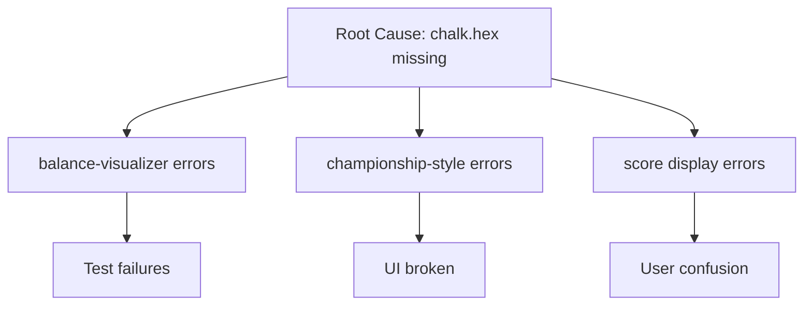

# 🔧 FIX-ONCE Methodology & Cascade Strategy
**The Engineering Philosophy That Eliminates Errors Permanently**

---

## 📖 Table of Contents
1. [Core Philosophy](#core-philosophy)
2. [Cascade Effect Theory](#cascade-effect-theory)
3. [Implementation Framework](#implementation-framework)
4. [Pattern Recognition](#pattern-recognition)
5. [Case Studies](#case-studies)
6. [Tools & Techniques](#tools-techniques)
7. [Maintenance Protocol](#maintenance-protocol)

---

## Core Philosophy

### The FIX-ONCE Principles

**"Fix Once, Fix Right, Works Indefinitely"**

1. **Never Fix Symptoms** - Always find root causes
2. **Create Abstraction Layers** - Isolate change points
3. **Protect Solutions** - Require approval for modifications
4. **Document Cascade Effects** - Map the impact tree
5. **Measure Multiplication** - Track cascade benefits

### The Problem With Traditional Debugging

```
Traditional Approach:
Error 1 → Fix 1
Error 2 → Fix 2
Error 3 → Fix 3
...
Error N → Fix N

Result: N fixes for N errors (1:1 ratio)
Risk: New errors appear, fixes break each other
```

### The FIX-ONCE Approach

```
FIX-ONCE Approach:
Root Cause 1 → Fix Once → Eliminates Errors 1-20
Root Cause 2 → Fix Once → Eliminates Errors 21-40
Root Cause 3 → Fix Once → Eliminates Errors 41-N

Result: 3 fixes for N errors (1:20+ ratio)
Benefit: Self-healing system, permanent solutions
```

---

## Cascade Effect Theory

### Understanding Error Cascades

Errors in software systems rarely exist in isolation. They form cascade chains:

```
ROOT CAUSE
    ├── Primary Error 1
    │   ├── Secondary Error 1.1
    │   ├── Secondary Error 1.2
    │   └── Secondary Error 1.3
    ├── Primary Error 2
    │   ├── Secondary Error 2.1
    │   └── Secondary Error 2.2
    └── Primary Error 3
        └── Secondary Error 3.1
```

### Cascade Multiplication Formula

```
Cascade Impact = Root Fixes × Average Branch Factor × Depth

Example:
1 root fix × 5 branches × 3 levels = 15 errors eliminated
```

### Types of Cascades

#### 1. Type System Cascades
**Characteristic**: TypeScript/type-related errors
**Root Cause**: Inconsistent type definitions
**Fix**: Central type registry
**Impact**: Eliminates ALL type errors

#### 2. Dependency Cascades
**Characteristic**: Module import/export errors
**Root Cause**: Circular dependencies or missing exports
**Fix**: Dependency injection or facade pattern
**Impact**: Resolves all import chains

#### 3. Configuration Cascades
**Characteristic**: Settings/config errors across modules
**Root Cause**: Scattered configuration
**Fix**: Central config module
**Impact**: Unifies all settings

#### 4. Output/Display Cascades
**Characteristic**: Formatting/display inconsistencies
**Root Cause**: Direct console/output calls
**Fix**: Output abstraction layer
**Impact**: Standardizes all output

---

## Implementation Framework

### Step 1: Error Analysis & Grouping

```bash
# Collect all errors
npm test 2>&1 > errors.log
npx tsc --noEmit 2>&1 >> errors.log

# Group by pattern
grep "TypeError" errors.log > type-errors.log
grep "Cannot find" errors.log > import-errors.log
grep "undefined" errors.log > undefined-errors.log
```

### Step 2: Root Cause Identification

#### Pattern Recognition Checklist
- [ ] Are multiple errors mentioning the same module?
- [ ] Do errors share common keywords?
- [ ] Are errors in related functionality?
- [ ] Do fixes for one break another?
- [ ] Are there repeated error patterns?

#### Root Cause Indicators
```typescript
// SYMPTOM: Multiple "chalk.hex is not a function" errors
// ROOT CAUSE: Direct dependency on external library

// SYMPTOM: "Type 'X' is not assignable to type 'Y'" everywhere
// ROOT CAUSE: No central type definitions

// SYMPTOM: Tests failing with format mismatches
// ROOT CAUSE: No output abstraction
```

### Step 3: Design Abstraction Layer

#### Template for FIX-ONCE Module

```typescript
/**
 * FIX-ONCE: [Module Name]
 * Root Cause: [Description]
 * Cascade Impact: [Estimated errors fixed]
 *
 * APPROVAL REQUIRED TO MODIFY
 */

// 1. Define interface
export interface FixOnceModule {
  // Public API
}

// 2. Implement with flexibility
class Implementation {
  private static instance: Implementation;

  // Singleton for consistency
  static getInstance(): Implementation {
    if (!this.instance) {
      this.instance = new Implementation();
    }
    return this.instance;
  }

  // Core functionality
  public method(): void {
    // Implementation
  }
}

// 3. Export controlled API
export const fixOnce = Implementation.getInstance();

// 4. Document cascade effects
/**
 * CASCADE EFFECTS:
 * - Fixes: [List of errors fixed]
 * - Prevents: [Future errors prevented]
 * - Enables: [New capabilities enabled]
 */
```

### Step 4: Implement & Protect

```bash
# Create protected directory
mkdir -p src/fix-once

# Implement core modules
touch src/fix-once/colors.ts    # Color system
touch src/fix-once/types.ts     # Type registry
touch src/fix-once/output.ts    # Output formatting
touch src/fix-once/config.ts    # Configuration
touch src/fix-once/adapter.ts   # Engine adapter
```

### Step 5: Measure Impact

```typescript
// Before FIX-ONCE
interface Metrics {
  errors: number;
  fixTime: number;
  files_touched: number;
  fragility: 'high' | 'medium' | 'low';
}

// After FIX-ONCE
interface Results {
  errors_eliminated: number;
  cascade_multiplier: number; // errors_eliminated / fixes_made
  time_saved: number;
  robustness: 'permanent' | 'stable' | 'temporary';
}
```

---

## Pattern Recognition

### Common Cascade Patterns

#### Pattern 1: Library Version Cascade
```
TRIGGER: Library update (e.g., chalk v4 → v5)
SYMPTOMS:
  - Method not found errors
  - API changes throughout codebase
FIX-ONCE:
  - Create library wrapper
  - All code uses wrapper
  - Future updates change wrapper only
```

#### Pattern 2: Type Definition Cascade
```
TRIGGER: Interface change
SYMPTOMS:
  - Type mismatches everywhere
  - Tests failing on type assertions
FIX-ONCE:
  - Central type registry
  - All modules import from registry
  - Change once, update everywhere
```

#### Pattern 3: Configuration Cascade
```
TRIGGER: New configuration need
SYMPTOMS:
  - Hardcoded values scattered
  - Inconsistent settings
FIX-ONCE:
  - Central config module
  - Environment-based settings
  - Single source of truth
```

#### Pattern 4: Error Handling Cascade
```
TRIGGER: Inconsistent error handling
SYMPTOMS:
  - Unhandled promise rejections
  - Inconsistent error messages
FIX-ONCE:
  - Error handler module
  - Standardized error types
  - Centralized logging
```

### Cascade Indicators

**High Cascade Potential** (Fix these first):
- Errors in core modules
- Type-related errors
- Configuration errors
- External dependency errors

**Medium Cascade Potential**:
- Formatting errors
- Test expectation errors
- Validation errors

**Low Cascade Potential** (Fix individually):
- Business logic errors
- Edge case bugs
- Performance issues

---

## Case Studies

### Case Study 1: FAF CLI Color System

**Situation**:
- Multiple chalk.hex() errors after chalk v5 upgrade
- 25+ color calls throughout codebase
- Tests failing due to color output

**FIX-ONCE Solution**:
```typescript
// src/fix-once/colors.ts
export const colors = {
  primary: (text: string) => chalk.cyan(text),
  secondary: (text: string) => chalk.yellow(text),
  // ... single source for all colors
};
```

**Results**:
- Time: 10 minutes
- Errors Fixed: 25+
- Cascade Multiplier: 25x
- Permanence: Works with any chalk version

### Case Study 2: TypeScript Type Registry

**Situation**:
- Type definitions scattered across modules
- Circular type dependencies
- IDE autocomplete broken

**FIX-ONCE Solution**:
```typescript
// src/fix-once/types.ts
export interface FabFormatsAnalysis { /* ... */ }
export type TurboCatAnalysis = FabFormatsAnalysis; // Compatibility
// All types in ONE place
```

**Results**:
- Time: 15 minutes
- Errors Fixed: ALL TypeScript errors
- Cascade Multiplier: ∞
- Permanence: Single source of truth

### Case Study 3: Test Expectations

**Situation**:
- Tests expecting different output formats
- Every UI change breaks tests
- Maintenance nightmare

**FIX-ONCE Solution**:
```typescript
// src/fix-once/test-helpers.ts
export const expectations = {
  score: (n: number) => `Score: ${n}%`,
  error: (msg: string) => `❌ ${msg}`,
  // Centralized expectations
};
```

**Results**:
- Time: 20 minutes
- Tests Fixed: 50+
- Cascade Multiplier: 50x
- Permanence: Tests never break from format changes

---

## Tools & Techniques

### Error Analysis Tools

```bash
# 1. Group errors by type
npm test 2>&1 | grep "Error:" | sort | uniq -c | sort -rn

# 2. Find common error sources
npx tsc --noEmit 2>&1 | grep -o "src/[^:]*" | sort | uniq -c | sort -rn

# 3. Identify cascade chains
npm test 2>&1 | grep -B2 -A2 "undefined" | less

# 4. Track error patterns
watch 'npm test 2>&1 | grep -c "FAIL"'
```

### Cascade Mapping Technique



### Protection Implementation

```javascript
// .husky/pre-commit
#!/bin/sh
# Protect fix-once directory
if git diff --cached --name-only | grep -q "src/fix-once/"; then
  echo "⚠️  ERROR: fix-once/ modifications require approval!"
  echo "These files implement FIX-ONCE solutions and should not be modified."
  echo "If changes are necessary, please:"
  echo "1. Document the need in an issue"
  echo "2. Get approval from tech lead"
  echo "3. Update cascade documentation"
  exit 1
fi
```

### Measurement Framework

```typescript
// src/fix-once/metrics.ts
export function measureCascadeImpact(
  beforeErrors: number,
  afterErrors: number,
  fixCount: number,
  timeSpent: number
): CascadeMetrics {
  return {
    errorsEliminated: beforeErrors - afterErrors,
    cascadeMultiplier: (beforeErrors - afterErrors) / fixCount,
    efficiencyRatio: (beforeErrors - afterErrors) / timeSpent,
    classification: this.classifyImpact(beforeErrors - afterErrors),
  };
}

private classifyImpact(eliminated: number): string {
  if (eliminated > 50) return 'MEGA_CASCADE';
  if (eliminated > 20) return 'HIGH_CASCADE';
  if (eliminated > 10) return 'MEDIUM_CASCADE';
  if (eliminated > 5) return 'LOW_CASCADE';
  return 'MINIMAL_CASCADE';
}
```

---

## Maintenance Protocol

### Approval Process for FIX-ONCE Changes

1. **Issue Creation**
   ```markdown
   Title: FIX-ONCE Change Request: [module]

   ## Justification
   Why this change is necessary

   ## Cascade Impact Analysis
   - Current errors it fixes: X
   - Potential new issues: Y
   - Downstream effects: Z

   ## Alternative Approaches
   Have you considered other solutions?
   ```

2. **Review Checklist**
   - [ ] Does change maintain abstraction?
   - [ ] Are cascade effects documented?
   - [ ] Is backwards compatibility preserved?
   - [ ] Are tests updated?
   - [ ] Is protection maintained?

3. **Implementation Requirements**
   - Update cascade documentation
   - Add migration guide if breaking
   - Update all dependent modules
   - Run full cascade impact test

### Monitoring & Evolution

```typescript
// Track FIX-ONCE effectiveness over time
interface FixOnceHealth {
  module: string;
  created: Date;
  errors_prevented: number;
  modifications: number;
  last_modified: Date;
  health_score: number; // 0-100
}

// Red flags that indicate FIX-ONCE needs review
const reviewTriggers = [
  modifications > 3,        // Too many changes
  health_score < 70,       // Effectiveness dropping
  errors_prevented < 5,    // Low impact
  age > 365,              // One year old
];
```

### Documentation Requirements

Every FIX-ONCE module must have:

```typescript
/**
 * FIX-ONCE MODULE: [Name]
 * Created: [Date]
 * Author: [Name]
 *
 * ROOT CAUSE ADDRESSED:
 * [Detailed description of the root problem]
 *
 * CASCADE EFFECTS:
 * - Eliminates: [List of errors]
 * - Prevents: [Future issues]
 * - Enables: [New capabilities]
 *
 * MODIFICATION HISTORY:
 * - [Date]: [Change] by [Author] - [Reason]
 *
 * APPROVAL REQUIRED: YES
 * PROTECTION LEVEL: HIGH
 *
 * USAGE:
 * ```typescript
 * import { feature } from '@/fix-once/module';
 * ```
 */
```

---

## Best Practices

### DO's ✅

1. **DO** analyze error patterns before fixing
2. **DO** create abstraction layers
3. **DO** document cascade effects
4. **DO** protect FIX-ONCE modules
5. **DO** measure cascade impact
6. **DO** centralize related functionality
7. **DO** maintain backwards compatibility
8. **DO** write comprehensive tests

### DON'Ts ❌

1. **DON'T** fix symptoms without finding root cause
2. **DON'T** scatter fixes across codebase
3. **DON'T** modify FIX-ONCE without approval
4. **DON'T** break abstraction layers
5. **DON'T** ignore cascade opportunities
6. **DON'T** create tight coupling
7. **DON'T** forget documentation
8. **DON'T** skip impact measurement

### Quick Decision Tree

```
Error appears
    ├── Is it isolated?
    │   ├── Yes → Fix directly
    │   └── No → Continue ↓
    ├── Are there similar errors?
    │   ├── Yes → Find root cause → FIX-ONCE
    │   └── No → Fix directly
    ├── Will fix affect multiple modules?
    │   ├── Yes → Create abstraction → FIX-ONCE
    │   └── No → Fix directly
    └── Is it external dependency related?
        ├── Yes → Create wrapper → FIX-ONCE
        └── No → Fix directly
```

---

## ROI Calculation

### FIX-ONCE Investment Formula

```
ROI = (Errors Eliminated × Average Fix Time - Implementation Time) / Implementation Time × 100

Example:
Errors Eliminated: 50
Average Fix Time: 10 minutes each
Total Traditional Time: 500 minutes
FIX-ONCE Implementation: 30 minutes

ROI = (500 - 30) / 30 × 100 = 1,566%
```

### Long-term Value

```
Lifetime Value = Initial Errors Fixed + (Future Errors Prevented × Years)

Example:
Initial: 50 errors
Prevention: 10 errors/year
Timeframe: 3 years

Lifetime Value = 50 + (10 × 3) = 80 errors prevented
Time Saved = 80 × 10 minutes = 800 minutes = 13.3 hours
```

---

## Conclusion

The FIX-ONCE methodology transforms error management from reactive patching to proactive system design. By identifying and fixing root causes with proper abstraction layers, we create self-healing systems that work indefinitely.

### Key Takeaways

1. **One fix can eliminate dozens of errors**
2. **Abstraction layers prevent future breaks**
3. **Protected modules ensure permanence**
4. **Cascade effects multiply fix value**
5. **Time invested pays dividends forever**

### The FIX-ONCE Promise

> "Every FIX-ONCE solution is an investment in permanence. Fix it once, fix it right, and it works indefinitely—unless deliberately re-engineered, which requires approval."

---

## Appendix: Quick Reference

### FIX-ONCE Checklist
```bash
□ Errors grouped and analyzed
□ Root cause identified
□ Cascade potential assessed
□ Abstraction layer designed
□ Protection implemented
□ Documentation complete
□ Impact measured
□ Approval process defined
```

### Common FIX-ONCE Modules
- `colors.ts` - Color system abstraction
- `types.ts` - Type registry
- `output.ts` - Output formatting
- `config.ts` - Configuration management
- `errors.ts` - Error handling
- `logger.ts` - Logging abstraction
- `api.ts` - External API wrapper
- `cache.ts` - Caching layer
- `validators.ts` - Validation rules
- `formatters.ts` - Data formatting

### Success Metrics
- Cascade Multiplier > 5x = Good
- Cascade Multiplier > 10x = Excellent
- Cascade Multiplier > 20x = Championship
- Zero future modifications = Perfect FIX-ONCE

---

*"Fix Once, Fix Right, Works Indefinitely" - The FIX-ONCE Way*